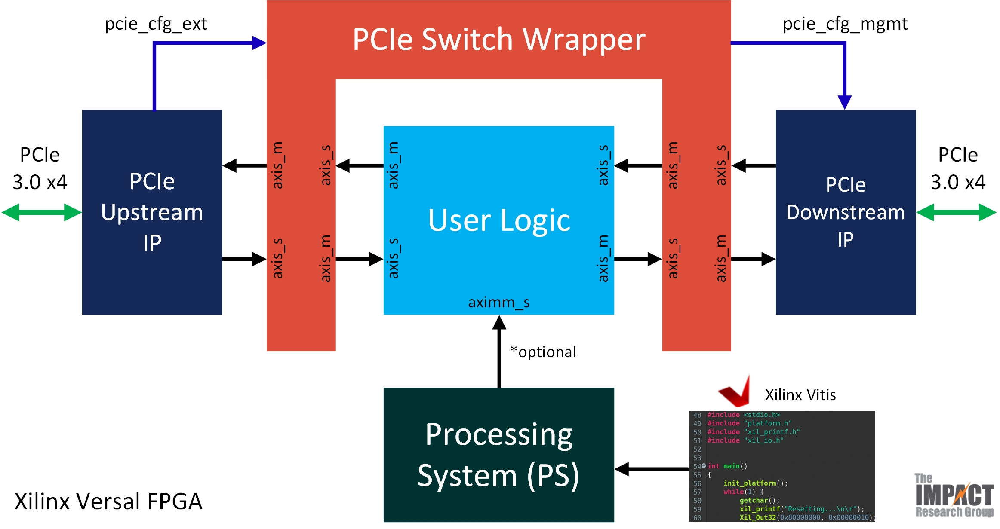
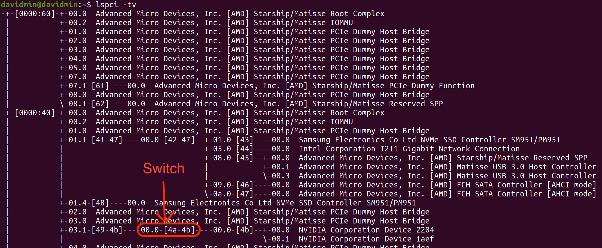
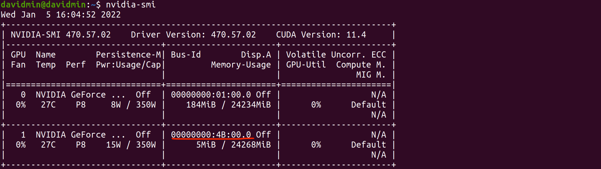

# SoftSwitch: Reprogammable PCIe Switch
Transform Xilinx Versal Devkit into a 2-port PCIe Switch

- [Prerequesites](#prerequesites)
- [Project Overview](#project-overview)
  - [Design Overview](#design-overview)
  - [Board Setup](#board-setup)
    - [Host System Used for Testing](#host-system-used-for-testing)
    - [PCIe Devices Tested](#pcie-devices-tested)
- [Synthesizing the Switch](#synthesizing-the-switch)
- [Bringing Up Versal PCIe Switch](#bringing-up-versal-pcie-switch)
  - [Preparation](#preparation)
  - [Bring Up](#bring-up)
- [Known Issues](#known-issues)
- [Licensing and Reference](#licensing-and-reference)

# Prerequesites
- FPGA Board: VCK190 or VMK180 (ES works)
- FMC+ to PCIe Card: HiTech Global PCI Express Gen4 Root FMC+ Module ([link](https://hitechglobal.us/index.php?route=product/product&path=18_85&product_id=273))
- Software/Tool: Vivado 2021.2

# Project Overview
Before we jump into the activation of the PCIe switch, we'll briefly show the overview of the design.

## Design Overview

The design is mainly consist of:
- One upstream PCIe IP with 3.0 x4 setting (connected to the host system)
- One downstream PCIe IP with 3.0 x4 setting (connected to the PCIe device choice of user)
- A wrapper to deal with basic PCIe device controls and to properly advertise the design as a PCIe-compatible switch device
- A space for user to insert their custom user logic + PS design

As you can see, this is a 2-port PCIe switch, which means currently this design is used to either probe or intercept data communication between two devices. To enable P2P communication between two PCIe devices except the host system, addtional efforts need to be made.

## Board Setup

For the setup image without the annotations, please view at [here](docs/img/setup_original.jpg).
1. PCIe connection to host system
2. Xilinx Versal Devkit (Xilinx Versal VCK190 ES1)
3. HiTech Global FMC+ card
4. Device under test (Intel 750 Series 400GB NVMe SSD)

### Host System Used for Testing
- CPU: AMD Threadripper 3960x
- Motherboard: ASUS Prime TRX40-Pro
- Memory: GSkill DDR4 32GBx8 (256GB)

### PCIe Devices Tested
- GPU: NVIDIA RTX 3090, NVIDIA RTX 1660
- NVMe SSD: Intel 750 Series
- Ethernet: 10G NIC

# Synthesizing the Switch
To synthesize the design in Vivado, we need to first patch two files in Vivado (up to 2021.2 version). The patch files are located in the [patch](./patch) directory. The files that we need to patch are the following two:

```
<Vivado installtion directory>/Vivado/<Vivado version>/data/ip/xilinx/pcie_versal_v1_0/xgui/pcie_versal_v1_0.tcl
<Vivado installtion directory>/Vivado/<Vivado version>/data/ip/xilinx/pcie_versal_v1_0/component.xml
```

Once you backup those files somewhere else safe, apply the patches by using the commands similar to the followings in Linux shell (e.g., bash):

```
$ patch /tools/Xilinx/Vivado/2021.2/data/ip/xilinx/pcie_versal_v1_0/xgui/pcie_versal_v1_0.tcl ./patch/pcie_versal_v1_0.tcl.patch
$ patch /tools/Xilinx/Vivado/2021.2/data/ip/xilinx/pcie_versal_v1_0/component.xml ./patch/component.xml.patch
```

Current project is built based on the engineering sample version of VCK190, so running the `create_project.tcl` script in the [hardware](./hardware) directory will require enabling the VCK190 ES1 platform in Vivado. The method to enable the engineering sample device should be available on the Xilinx early access portal if you own the device. We will consider creating a new script for the non-ES platform in future.

Now, to recreate the project, use the following commands:

```
$ cd ./hardware
$ vivado -mode batch -source create_project.tcl
```

# Bringing Up Versal PCIe Switch
## Preparation
1. This may depend on the board setup, but for our case, VCK190 ES1 PCIe connection required the PCIe Spread Spectrum (PSS) of the host system to be turned off.
2. Since our design does not support 10-bit tag capability, this needs to be explicitly turned off from the motherboard BIOS.
## Bring Up
1. Turn off all devices including FPGA and the host system.
2. Turn on the FPGA.
3. Turn on the host system and wait until the entire boot process is done.
4. Program the FPGA with the PCIe switch bitstream.
5. Reboot the host system.
6. When the host system is fully booted, check the PCIe device status using the `lspci` command. You should see the Xilinx switch PCIe devices and the PCIe device under test.

Working example with NVIDIA GPU:

lspci:


lspci tree:


nvidia-smi, verifying GPU connection:


# Known Issues
1. The current FPGA switch design does not officially support PCIe 2.0 mode. It may work for some cases, but it is not guaranteed.

# Licensing and Reference
This work is done as a part of Xilinx Adaptive Compute Clusters ([XACC](https://xilinx.github.io/xacc/index.html)) program. There is no additional licensing required for using this design (beside the Vivado licenses).
